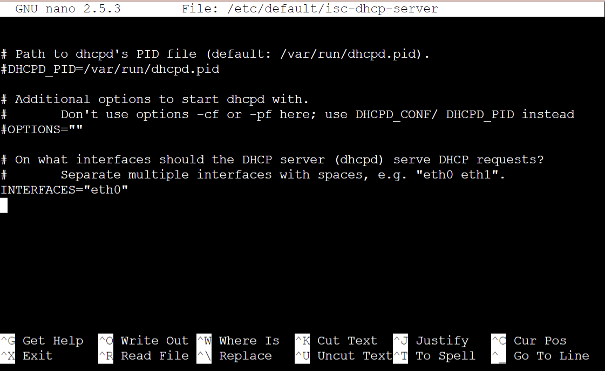
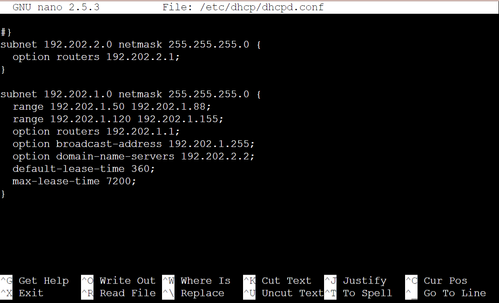
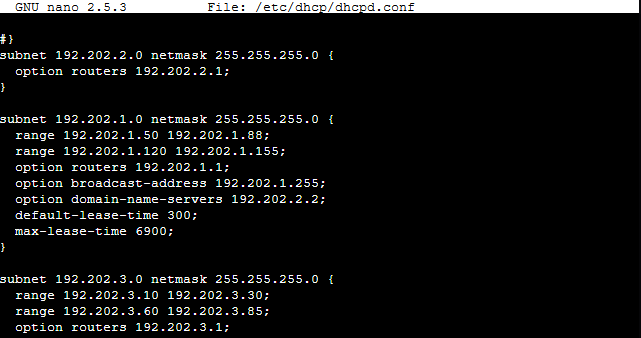

# Jarkom-Modul-3-F06-2022

## Kelompok F06

|               Nama               |      NRP      |
| -------------------------------- | ------------- |
| Benedictus Bimo Cahyo Wicaksono  |  5025201097   |  
| Andhika Ditya Bagaskara D.       |  5025201096   |
| Theresia Nawangsih               |  5025201144   |

# Soal 1
### Loid bersama Franky berencana membuat peta tersebut dengan kriteria WISE sebagai DNS Server, Westalis sebagai DHCP Server, Berlint sebagai Proxy Server.

Pertama, dilakukan konfigurasi untuk masing-masing node.

WISE -> DNS Server
```
auto eth0
iface eth0 inet static
  address 192.202.2.2
  netmask 255.255.255.0
  gateway 192.202.2.1
```

Westalis -> DHCP Server
```
auto eth0
iface eth0 inet static
  address 192.202.2.4
  netmask 255.255.255.0
  gateway 192.202.2.1
```

Berlint -> Proxy Server
```
auto eth0
iface eth0 inet static
  address 192.202.2.3
  netmask 255.255.255.0
  gateway 192.202.2.1
```

Ostania -> DHCP Relay
```
auto eth0
iface eth0 inet dhcp

auto eth1
iface eth1 inet static
address 192.202.1.1
netmask 255.255.255.0

auto eth2
iface eth2 inet static
address 192.202.2.1
netmask 255.255.255.0

auto eth3
iface eth3 inet static
address 192.202.3.1
netmask 255.255.255.0
```

SSS & Garden
```
auto eth0
iface eth0 inet dhcp
```

EDEN
```
auto eth0
iface eth0 inet static
  address 192.202.3.2
  netmask 255.255.255.0
  gateway 192.202.3.1
```

NewstonCastle
```
auto eth0
iface eth0 inet static
  address 192.202.3.3
  netmask 255.255.255.0
  gateway 192.202.3.1
```

KemonoPark
```
auto eth0
iface eth0 inet static
  address 192.202.3.4
  netmask 255.255.255.0
  gateway 192.202.3.1
```

Kemudian di Ostania, jalankan
```
iptables -t nat -A POSTROUTING -o eth0 -j MASQUERADE -s 192.202.0.0/16
```

Kemudian jalankan pada semua node
```
echo nameserver 192.168.122.1 > /etc/resolv.conf
```

# Soal 1
### Loid bersama Franky berencana membuat peta tersebut dengan kriteria WISE sebagai DNS Server, Westalis sebagai DHCP Server, Berlint sebagai Proxy Server

Pada WISE sebagai DNS Server, dilakukan instalasi bind9
```
apt-get update
apt-get install bind9 -y
service bind9 start
service bind9 status
```

Pada Westalis sebagai DHCP Server, dilakukan instalasi isc-dhcp-server
```
apt-get update
apt-get install isc-dhcp-server -y
```

Dan untuk Berlint sebagai Proxy Server, dilakukan instalasi squid.
```
apt-get update
apt-get install squid -y
service squid restart
service squid status
```

# Soal 2
### Dan Ostania sebagai DHCP Relay.

Pada Ostania sebagai DHCP Relay, dilakukan instalasi isc-dhcp-relay
```
apt-get update
apt-get install isc-dhcp-relay -y
```

Kemudian dilakukan konfigurasi pada `/etc/default/isc-dhcp-relay`
```
nano /etc/default/isc-dhcp-relay
```

dan tambahkan
```
SERVERS = "192.202.2.4"
INTERFACES = "eth1 eth2 eth3"
```

<p align="center">
  
</p><br>

setelah itu, restart isc-dhcp-relay.
```
service isc-dhcp-relay restart
```

### Loid dan Franky menyusun peta tersebut dengan hati-hati dan teliti. Ada beberapa kriteria yang ingin dibuat oleh Loid dan Franky, yaitu:
### Semua client yang ada HARUS menggunakan konfigurasi IP dari DHCP Server.

# Soal 3
### Client yang melalui Switch1 mendapatkan range IP dari [prefix IP].1.50 - [prefix IP].1.88 dan [prefix IP].1.120 - [prefix IP].1.155

Karena Westalis adalah DHCP Server, maka dilakukan konfigurasi pada file `/etc/default/isc-dhcp-server`
```
INTERFACES = "eth0"
```
<p align="center">
  
</p><br>

Kemudian tambahkan konfugirasi berikut pada file `/etc/dhcp/dhcpd.conf`
```
subnet 192.202.2.0 netmask 255.255.255.0 {
  option routers 192.202.2.1;
}

subnet 10.8.1.0 netmask 255.255.255.0 {
  range 192.202.1.50 192.202.1.88;
  range 192.202.1.120 192.202.1.155;
  option routers 192.202.1.1;
  option broadcast-address 192.202.1.255;
  option domain-name-servers 192.202.2.2;
  default-lease-time 360;
  max-lease-time 7200;
}
```

<p align="center">
  
</p><br>

Setelah itu, restart isc-dhcp-server.
```
service isc-dhcp-server restart
service isc-dhcp-server status
```

# Soal 4
### Client yang melalui Switch3 mendapatkan range IP dari [prefix IP].3.10 - [prefix IP].3.30 dan [prefix IP].3.60 - [prefix IP].3.85

Pada Westalis, ditambahkan konfugirasi berikut pada file `/etc/dhcp/dhcpd.conf`
```
subnet 192.202.2.0 netmask 255.255.255.0 {
  option routers 192.202.2.1;
}

subnet 10.8.1.0 netmask 255.255.255.0 {
  range 192.202.1.50 192.202.1.88;
  range 192.202.1.120 192.202.1.155;
  option routers 192.202.1.1;
  option broadcast-address 192.202.1.255;
  option domain-name-servers 192.202.2.2;
  default-lease-time 360;
  max-lease-time 7200;
}
```

<p align="center">
  
</p><br>

Setelah itu, restart isc-dhcp-server.
```
service isc-dhcp-server restart
service isc-dhcp-server status
```

# Soal 5
### Client mendapatkan DNS dari WISE dan client dapat terhubung dengan internet melalui DNS tersebut.

Pada Wise, ditambahkan konfugirasi berikut pada file `/etc/bind/named.conf.options`
```
forwarders {
    192.202.2.1;
}; 

// dnssec-validation auto;
allow-query{any;};
service bind9 restart
```

<p align="center">
  
</p><br>

Pada Client melakukan testing, dengan menggunakan
```
ping 192.202.2.2
ping google.com
```

<p align="center">
  
</p><br>

<p align="center">
  
</p><br>

# Soal 6
### Lama waktu DHCP server meminjamkan alamat IP kepada Client yang melalui Switch1 selama 5 menit sedangkan pada client yang melalui Switch3 selama 10 menit. Dengan waktu maksimal yang dialokasikan untuk peminjaman alamat IP selama 115 menit.

Pada Westalis, ditambahkan konfugirasi berikut pada file `/etc/bind/named.conf.options`
```
subnet 192.202.1.0 netmask 255.255.255.0 {
  range 192.202.1.50 192.202.1.88;
  range 192.202.1.120 192.202.1.155;
  option routers 192.202.1.1;
  option broadcast-address 192.202.1.255;
  option domain-name-servers 192.202.2.2;
  default-lease-time 300;
  max-lease-time 6900;
}
subnet 192.202.3.0 netmask 255.255.255.0 {
  range 192.202.3.10 192.202.3.30;
  range 192.202.3.60 192.202.3.85;
  option routers 192.202.3.1;
  option broadcast-address 192.202.3.255;
  option domain-name-servers 192.202.2.2;
  default-lease-time 600;
  max-lease-time 6900;
}
```

<p align="center">
  
</p><br>

<p align="center">
  
</p><br>

Setelah itu, restart isc-dhcp-server.
```
service isc-dhcp-server restart
service isc-dhcp-server status
```


# Soal 7
### Loid dan Franky berencana menjadikan Eden sebagai server untuk pertukaran informasi dengan alamat IP yang tetap dengan IP [prefix IP].3.13 

Pada Westalis, ditambahkan konfugirasi berikut pada file `/etc/bind/named.conf`
```
host Eden {
    hardware ethernet f6:09:9e:66:0d:94;
    fixed-address 192.202.3.13;
}
```
<p align="center">
  
</p><br>

Lalu dilanjutkan dengan
```
apt-get update
apt-get install lynx
```


# Proxy Server
## SSS, Garden, dan Eden digunakan sebagai client Proxy agar pertukaran informasi dapat terjamin keamanannya, juga untuk mencegah kebocoran data. Pada Proxy Server di Berlint, Loid berencana untuk mengatur bagaimana Client dapat mengakses internet. Artinya setiap client harus menggunakan Berlint sebagai HTTP & HTTPS proxy. Adapun kriteria pengaturannya adalah sebagai berikut:

# Soal 1
### Client hanya dapat mengakses internet diluar (selain) hari & jam kerja (senin-jumat 08.00 - 17.00) dan hari libur (dapat mengakses 24 jam penuh)

# Soal 2
### Adapun pada hari dan jam kerja sesuai nomor (1), client hanya dapat mengakses domain loid-work.com dan franky-work.com (IP tujuan domain dibebaskan)

# Soal 3
### Saat akses internet dibuka, client dilarang untuk mengakses web tanpa HTTPS. (Contoh web HTTP: http://example.com)

# Soal 4
### Agar menghemat penggunaan, akses internet dibatasi dengan kecepatan maksimum 128 Kbps pada setiap host (Kbps = kilobit per second; lakukan pengecekan pada tiap host, ketika 2 host akses internet pada saat bersamaan, keduanya mendapatkan speed maksimal yaitu 128 Kbps)

# Soal 5
### Setelah diterapkan, ternyata peraturan nomor (4) mengganggu produktifitas saat hari kerja, dengan demikian pembatasan kecepatan hanya diberlakukan untuk pengaksesan internet pada hari libur


